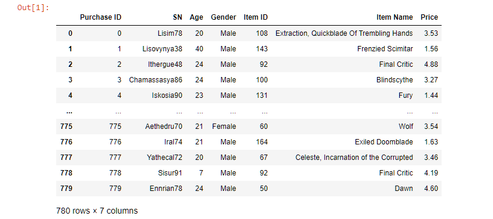
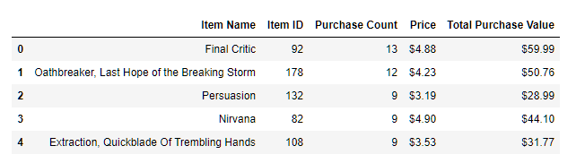

# Playerbase Data Analysis

# Prompt
Using the provided dataset for the free-to-play video game generate a report about the player base. Explore the following points of interest:
1. Total Number of Players  
2. Purchasing Analysis (Total)  
3. Gender Demographics
4. Purchasing Analysis (Gender)   
5. Age Demographics  
6. Top Spenders   
7. Most Popular Items  
8. Most Profitable Items

# Dependencies
* Jupyter Notebook
* Pandas
* Numpy
  
# Process  

  1. Data Wrangling  
   The data is stored in a CSV to read the csv we use Panda's `read_csv()` and save it to a variable. A master dataframe in created from that CSV. Now we can use the dataset throughout the jupyter notebook.  
  
   
  
  2. Analysis

      - **Total Number of Players**  
        Each row within the CSV is different purchase within the game. However, there is no limit on how many purchases a player can make so using the total number of purchases won't work. To find the actual number of players we need to get the number of unique player names and count the length of that list. `value_counts()` can be used on the dataframe to confirm that some players made more than one purchase.
        
         
        
       - **Purchasing Analysis (Total)**  
          To get the purchasing data we're interested the full dataframe needs to be trimmed down to just the relevant data. This reduced data is then converted into a dictionary with the data points of interst as the keys and the formulas to get the numbers as the values. The raw numberical values are fomatted using `.map()` and the appropritate format tag to make the data more readable.

           

      - **Gender Demographics**  
        Gender is the CSV is divided into three categories female, non-disclosed, and male. The get a dataframe for each with just the relevant gender `.loc()` is used on the master dataframe. These three new dataframes are then used to create a final dataframe that shows all the statistics of interest on one table. Gender is set as the index for readability.  

      - **Purchasing Analysis (Gender)**  
        Using the previously created dataframes the mean is calculated using the sum of purchases divided by the total unique users in each category. That dataframe is formatted as necessary and combined with the demographics to get the final gender dataframe

           

      - **Age**  
        The key to making the age analysis useful is to separate it into multiple bins. In this case each bin is a range of four years. Once the bins are created aggregate functions can be run on that dataframe to get the requested information. Columns are renamed and mapped as necessary to create a more presentable dataframe. 

         

      - **Top Spenders**  
        Since users can make as many purchases as they want the purchases need to be grouped by SN which is the unique identifier for each player in the game. The aggregate functions count, sum, and mean are applied to each user. To get the top spenders `sort_values` is applied to the "Total Purchases Value" column. The parameter ascending is set to false so that is appears in descending order. Only the top 5 were requested so `head()` can handle that without any additional parameters

         

      - **Most Popular Items**  
        To get the list of most popular items by purchase count two dataframes are required. One for each unique item with its id and price and another for running aggregate functions. These two dataframes are merged on the item name. The merged dataframe is sorted in descending order by purchase count and previously explained formatting methods were applied.

         

      - **Most Profitable Items**  
        The same process that was used to find the most popular items is used to find the most profitable. The only difference is the column that the dataframe is sorted on. For this instance, the "Total Purchase Value" column is used.

         

# Trends
1) The majority of the player base comes from the 18-22 and 22-26 age groups. They account for 61% of the revenue and 59% of players.

2) The player base is predominantly male but the average spending was close amongst the genders. With female players spending the most per person on average.

3) The item "Final Critic" had prices of 4.88 and 4.19. This temporary 14% reduction in price resulted to it being the most popular and most profitable item in the game.
